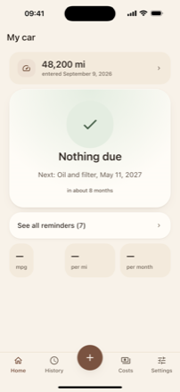
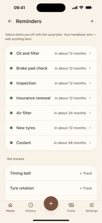
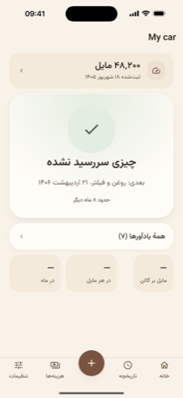
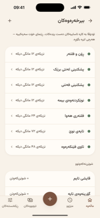

<div align="center">


# Odova

**Your car, handled.**

An offline, account-free log for car maintenance, fuel and running costs.

[](https://github.com/zakariaf/Odova/actions/workflows/ci.yml)


[](LICENSE)

</div>

---

<div align="center">


&nbsp;

&nbsp;

&nbsp;


<sub>Home and Reminders in English · the same two in فارسی and کوردیی ناوەندی —
mirrored, with Jalali dates and Eastern Arabic numerals</sub>

</div>

---

Most people look after their car by remembering. They remember the oil was
changed "sometime last spring", they keep a fuel receipt in the door pocket, and
they find out the timing belt was overdue when it breaks.

Odova replaces remembering with a phone that already knows. You add your car and
its current odometer reading. It tracks what has been done and works out what is
due next — **by distance and by date, whichever comes first** — and tells you
before it becomes a repair bill instead of a service.

The home screen answers one question: **what does my car need next?** Everything
else in the app exists to make that answer correct.

## What it does

- **Service reminders** — oil and filter, brake pads, tyres, coolant, battery,
  timing belt, inspection, and anything you add. Each is due at an interval *and*
  a date; the app watches both.
- **Fuel tracking** — log a fill-up in a few taps. Real consumption
  (L/100 km, km/L, MPG US or imperial), cost per fill, and whether the car is
  quietly getting thirstier.
- **Mileage log** — odometer readings over time, so every reminder stays accurate
  without you doing arithmetic.
- **Trips and expenses** — what the car actually costs: fuel, service, insurance,
  tax, parking, tolls, per month and per kilometre.
- **Service history** — every job, date, reading and price in one place. Worth
  real money when you sell the car.
- **More than one vehicle** — the second car, the motorbike, the work van.

## The rules it is built to

| Rule | What it means for you |
|---|---|
| **No account** | No sign-up, no email, no password. Open it and use it. |
| **No server, no sync, no analytics** | The app ships with no networking code. Odova uploads nothing, because there is nothing in it to upload through. Your phone's own iCloud backup may include the app's data, as it does for any app — that is yours and Apple's, not ours. |
| **Offline, always** | It works in a basement car park in aeroplane mode, forever. |
| **Your backup is a plain JSON file** | Export it, keep it wherever you like, read it in a text editor. No password to lose, no account to recover. |
| **Six languages, both directions** | English, Deutsch, Français, فارسی, العربية, کوردیی ناوەندی — right-to-left is a first-class target, not a port. |
| **Calm** | It tells you what matters and stays quiet otherwise. At most two notifications in any seven days, across every vehicle combined. |

## Where this is

**Built, and not yet submitted.** All nineteen epics are merged: 28 screens in
six languages and both reading directions, a due engine that counts distance and
date together, fuel maths from real fill-ups, backup and restore, local
reminders, and the release engineering around them. `flutter test` is 5,109
green.

**What stands between here and the App Store is a design sign-off, not code.**
[`design/review/SIGNOFF-2026-09-08.md`](design/review/SIGNOFF-2026-09-08.md)
reads **NOT SIGNED**, and says why: the vertical band profile fails on 106 of
112 parity comparisons, and no release build has ever been looked at.
`tools/release.sh` treats that file as a precondition and refuses while it says
so. Signing it to clear a checklist would make the release ritual's first
assumption false.

Two other things are open and worth naming, because both need a person rather
than a commit:

- **Kurdish Sorani has not been read by a native speaker.** `SPEC.md` §18.11
  calls it the single largest risk to the right-to-left launch. The app's
  strings and the store listing are both written to the same shape as the other
  five languages, and both should be reviewed before submission.
- **The aeroplane-mode pass has not happened.** §17's offline gate ends in a
  manual walk from a clean install on a device that has never been online. A
  simulator borrows the host's networking, so it cannot stand in.

### The map

| File | What it is |
|---|---|
| [`SPEC.md`](SPEC.md) | The full specification — data model, due engine, six-locale contract, backup format, every screen and every navigation edge. 18 sections, and still the source of truth. |
| [`IDEA.md`](IDEA.md) | The idea in plain words, plus the naming research: how the name was chosen and what was checked against both app stores. |
| [`design/`](design/README.md) | The Calm design system and 112 reference screenshots in light/dark and LTR/RTL, which the parity gates compare the built screens against. |
| [`epics/`](epics/README.md) | The 19 executable build epics, and [`epics/progress/`](epics/progress/) — one file per epic recording what was decided, what was deferred, and what the tests found. |
| [`store/`](store/README.md) | The App Store listing in six languages, the screenshots, and the privacy answers with `SPEC.md` §18 decision 12 closed in writing. |
| [`.claude/`](.claude/README.md) | 47 Flutter engineering skills — 40 vendored, 7 written here for the Calm design system. |
| `lib/` | The app. Seven directories with a stated owner each — `app core data features l10n theme ui` — and a policy test that keeps the list at seven. |
| `tools/` | The repo gates, the release ritual, and `check_gates_selftest.sh`, which plants a real violation for every gate and asserts both arms. |

Start with **§1 Who it is for** and **§2 Non-negotiables**. If you are about to
propose a feature, read **§15 Explicitly out of v1** first.

### iOS first

v1 ships to the App Store and not to Google Play. That is a deliberate decision,
recorded in [`epics/EPIC-19-release.md`](epics/EPIC-19-release.md) along with
what it costs — the strongest mechanical evidence for the zero-network claim was
Android's merged manifest, and iOS has no equivalent.

The Android build stays in CI anyway: compiling for a second platform is a cheap
check that catches a plugin resolving on one and not the other. It is a
compile target, not a shipping one.

## Building

```bash
flutter --version           # must match .flutter-version (3.44.6)
flutter pub get --enforce-lockfile
flutter test
flutter run
```

Repo gates, which run with no Flutter toolchain at all:

```bash
bash tools/check_gates_selftest.sh    # proves each gate can fail
bash tools/check_release_hygiene.sh   # no signing material, tree or history
bash tools/check_dependabot.sh        # the pub block is armed, not commented
python3 tools/check_spec_examples.py  # SPEC.md's JSON examples parse
```

Gates that need the resolved dependency tree, so a `flutter pub get` first:

```bash
# --require-graph: without it the audit exits 0 when it cannot resolve the
# tree, having walked nothing. CI passes it and so should you.
bash tools/audit_deps.sh --require-graph   # no dependency opens a network path
bash tools/check_lint_include.sh      # the lint ruleset is actually loaded
```

And the two that need a built artifact rather than source:

```bash
flutter build ios --simulator --debug
bash tools/check_binary_offline.sh build/ios/iphonesimulator/Runner.app
bash tools/release.sh --dry-run       # names every release precondition it checked
```

`check_binary_offline.sh` walks every Mach-O in the bundle — the Dart AOT image
and each plugin's framework, not just the Swift host — for imported networking
symbols and linked networking libraries. It is a link-time fact, so it survives
obfuscation and describes what actually ships.

## Contributing

See [CONTRIBUTING.md](CONTRIBUTING.md). The short version: the spec is decided
before the code is, every user-visible string lands in all six locales at once,
and no dependency may open a network path.

**Native Persian, Arabic and Kurdish Sorani readers are especially welcome** —
`SPEC.md` §18 lists open questions that only a native reader can settle, and
Sorani translation quality is the single largest risk to the launch.

## Licence

[Apache 2.0](LICENSE) © 2026 Zakaria Fatahi. Episode 6 of a 50-app challenge.
